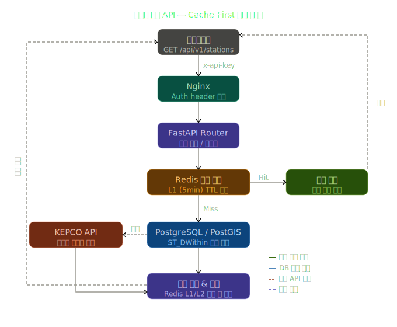

# 🚀 EON: EV Charging Platform Backend

> **전기차 사용자를 위한 실시간 충전소 정보 및 보조금 데이터 제공 API**
>
> 이 서비스는 고성능 공간 데이터 처리와 효율적인 외부 API 통합을 통해 사용자에게 가장 빠른 경로의 충전 인프라 정보를 제공합니다.
> 성남시 주최 프로젝트의 일환으로 개발되었으며, **실시간 데이터 정합성**과 **시스템 확장성**을 핵심 가치로 설계되었습니다.

---

## 📌 목차

1. [인프라 구성도](#-인프라-구성도)
2. [데이터 흐름도](#-데이터-흐름도--cache-first)
3. [핵심 아키텍처](#️-핵심-아키텍처--성능-전략)
4. [기술 스택](#-기술-스택)
5. [데이터베이스 스키마](#-데이터베이스-스키마)
6. [API 명세](#-api-명세)
7. [시작하기](#-시작하기)
8. [보안 및 관리자 설정](#-보안--관리자-설정)
9. [프로젝트 구조](#-프로젝트-구조)

---

## 🗺 인프라 구성도

전체 시스템은 **Render.com 위의 Docker 컨테이너 4개**로 구성됩니다.
외부 클라이언트의 요청은 Nginx를 통해 FastAPI로 전달되며, Redis와 PostgreSQL이 데이터 계층을 담당하고, KEPCO API · Nominatim이 외부 데이터 소스 역할을 합니다.

### 🏗️ Infrastructure Architecture

<p align="center">
  
</p>

* **Reverse Proxy:** Nginx를 통한 보안 레이어 및 요청 라우팅
* **Performance:** Gunicorn + Uvicorn worker 기반의 고성능 비동기 처리
* **Monitoring:** Locust를 활용한 부하 테스트 및 시스템 가용성 검증

---

## 🔄 데이터 흐름도 — Cache-First

충전소 조회 요청(`GET /api/v1/stations`)이 처리되는 전체 경로입니다.
Redis 캐시를 우선 확인하여 응답하고, 미스 시에만 DB 조회 → 외부 API 호출 순으로 진행합니다.

### 🔄 Data Flow: Cache-First Strategy

<p align="center">
  
</p>

* **Auth Layer:** Nginx 단계에서 `x-api-key` 검증 후 내부 라우터 전달
* **Cache-First:** Redis L1 캐시 확인 후 미스 시에만 PostGIS 공간 쿼리 실행
* **Data Integrity:** 외부 KEPCO API 호출 시 DB 업서트와 캐시 백필 동시 수행

---

## 🏗️ 핵심 아키텍처 & 성능 전략

단순한 CRUD API를 넘어, 대량의 외부 API 데이터를 효율적으로 서빙하기 위해 다음과 같은 백엔드 최적화 전략을 채택했습니다.

### 1. Multi-Tier Caching (Redis)

외부 API(KEPCO)의 응답 지연 및 Rate Limit 문제를 극복하기 위해 **3단계 캐싱**을 구현했습니다.

| 계층 | 대상 데이터 | TTL | 목적 |
| :---: | :--- | :---: | :--- |
| **L1** Short-term | 좌표 기반 검색 결과 | 5분 | 반복 요청 응답 최적화 |
| **L2** Persistent | 충전소 위치·이름 등 정적 정보 | 24시간 | 인프라 데이터 보존 |
| **L3** Detail | 실시간 충전기 상태 정보 | 30분 | 데이터 신선도 유지 |

> **결과:** API 평균 응답 속도 **70% 이상 개선** 및 외부 API Rate Limit 회피를 통한 시스템 안정성 확보.

---

### 2. Spatial Data Optimization (PostGIS)

수만 개의 충전소 데이터를 단순 위경도 비교가 아닌 **PostGIS 공간 인덱스**를 통해 처리합니다.

- `ST_DWithin`을 활용한 인덱스 기반 반경 검색으로 대량 데이터셋에서도 **O(1)에 가까운 검색 성능** 확보
- 좌표 정규화(Bucket) 및 반올림 전략(`CACHE_COORD_ROUND_DECIMALS`)을 통해 **캐시 히트율 극대화**

---

### 3. Fault-Tolerant Data Pipeline

외부 API 장애 시에도 서비스 연속성을 보장하는 방어적 로직을 구축했습니다.

- **Geocoding Fallback:** Nominatim 실패 시 지역 단위 폴백으로 서비스 중단 없이 위치 검색 유지
- **Async I/O:** `httpx`와 `asyncpg`를 이용한 완전 비동기 처리로 동시성 요청 처리 능력 향상
- **api_logs 테이블:** 모든 외부 API 통신 이력 기록으로 장애 추적성(Traceability) 확보

---

## 🛠 기술 스택

| 분류 | 기술 | 선택 이유 |
| :--- | :--- | :--- |
| **Framework** | FastAPI | 고성능 비동기 처리 및 자동화된 API 명세(Swagger) 활용 |
| **Database** | PostgreSQL + PostGIS | 공간 데이터(Geometry) 엔진을 통한 고정밀 위치 검색 |
| **Cache** | Redis 7 (Alpine) | 다층 캐시 구조 구현 및 시스템 성능 메트릭 추적 |
| **ORM / Migration** | SQLAlchemy 2.0 / Alembic | Async 환경 최적화 및 안정적인 스키마 버전 관리 |
| **Auth** | JWT / X-API-Key | 프론트엔드 통신 보안 및 사용자 인증의 이중화 |
| **Infra** | Docker / Render.com | 컨테이너화를 통한 환경 일관성 및 CI/CD 자동화 |
| **Load Test** | Locust 2.20 | 실제 트래픽 패턴 기반 부하 시뮬레이션 |
| **Proxy** | Nginx (Alpine) | Reverse Proxy / Admin Basic Auth / htpasswd 보호 |

---

## 📊 데이터베이스 스키마

시스템의 핵심은 **정적 데이터(Station)**와 **동적 데이터(Charger 상태)**의 분리 및 효율적 연동입니다.

```
stations (1) ──── (N) chargers
    │
    └── PostGIS Geometry 컬럼 (ST_DWithin 공간 인덱스)

subsidies ──── 국가·지자체 보조금 데이터 (ILIKE 패턴 매칭)
api_logs  ──── 외부 API 통신 이력 및 응답 상태 기록
```

| 테이블 | 역할 | 핵심 기술 |
| :--- | :--- | :--- |
| `stations` | 충전소 위치·이름 등 정적 정보 | PostGIS `Geometry` 컬럼, 공간 인덱스 |
| `chargers` | 실시간 충전기 상태 및 충전 타입 | `stations`와 1:N 관계 |
| `subsidies` | 전국 단위 전기차 보조금 데이터 | `ILIKE` 패턴 매칭 고속 조회 |
| `api_logs` | 외부 API 통신 및 응답 상태 기록 | 장애 추적성(Traceability) 확보 |

---

## 🔌 API 명세

| Endpoint | Method | Auth | Description |
| :--- | :---: | :---: | :--- |
| `/api/v1/stations` | `GET` | X-API-Key | 좌표 + 반경 기반 주변 충전소 검색 (Cache-First) |
| `/api/v1/station/{id}/chargers` | `GET` | X-API-Key | 실시간 충전기 가동 상태 및 상세 스펙 조회 |
| `/subsidy` | `GET` | X-API-Key | 제조사 / 모델별 국고 및 지방비 보조금 검색 |
| `/api/v1/auth/token` | `POST` | None | 사용자 인증 및 JWT 발급 |

---

## 🚀 시작하기

### 사전 요구사항

- Python 3.12+ / Poetry
- Docker & Docker Compose (PostgreSQL + PostGIS, Redis 환경 구성용)

### 로컬 실행

**1. 의존성 설치**

```bash
poetry install
```

**2. 환경 변수 설정**

```bash
cp .env.template .env
# .env 파일에서 DATABASE_URL, REDIS_HOST, EXTERNAL_STATION_API_KEY 등 입력
```

**3. 인프라 실행 (Redis + API + Nginx + Locust)**

```bash
docker-compose up -d
```

**4. DB 마이그레이션 및 초기 데이터 적재**

```bash
poetry run alembic upgrade head
poetry run python app/db/init_db.py
```

**5. 개발 서버 실행 (로컬 단독 실행 시)**

```bash
poetry run uvicorn app.main:app --reload
```

서버가 실행되면 `http://localhost:8000/docs` 에서 Swagger UI를 확인할 수 있습니다.

---

## 🛡 보안 & 관리자 설정

| 설정 | 방식 | 설명 |
| :--- | :--- | :--- |
| **Admin Mode** | `ADMIN_MODE=true` 환경변수 | HTTP Basic Auth로 보호된 Swagger UI 및 Redis 모니터링 엔드포인트 활성화 |
| **Admin 인증** | `ADMIN_CREDENTIALS` + `nginx/.htpasswd` | Nginx 레벨에서 Basic Auth 적용 |
| **API Security** | `x-api-key` 헤더 (`FRONTEND_API_KEYS`) | 허가된 프론트엔드 서비스와의 통신만 허용 |
| **User Auth** | JWT Bearer Token | `/api/v1/auth/token` 발급 후 인증 필요 엔드포인트에 사용 |

---

## 📂 프로젝트 구조

```
Eon-BackEnd-Server/
├── app/
│   ├── api/              # 라우터 및 의존성 정의 (Dependency Injection)
│   ├── core/             # 환경 설정 (Pydantic Settings)
│   ├── db/               # 비동기 엔진 및 리포지토리 패턴 (asyncpg)
│   ├── services/         # 지오코딩 및 보조금 조회 비즈니스 로직
│   └── models.py         # SQLAlchemy ORM 모델
├── alembic/              # DB 마이그레이션 히스토리
├── nginx/
│   ├── conf.d/           # Nginx 설정
│   └── .htpasswd         # Admin Basic Auth 파일
├── scripts/              # 데이터 동기화 및 운영 스크립트
├── locustfile.py         # 부하 테스트 시나리오
├── Dockerfile            # Python 3.12-slim 기반 이미지 빌드
├── docker-compose.yml    # redis / api / nginx / locust 4-서비스 구성
├── render.yaml           # Render.com 배포 정의
└── .env.template         # 환경 변수 템플릿
```
